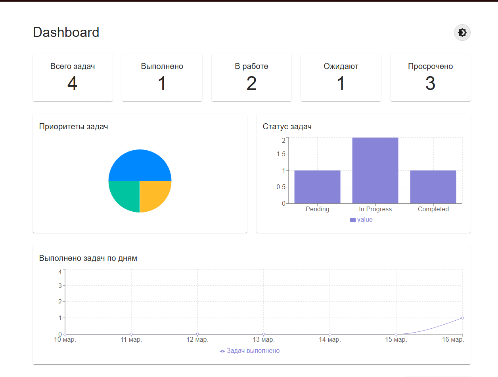
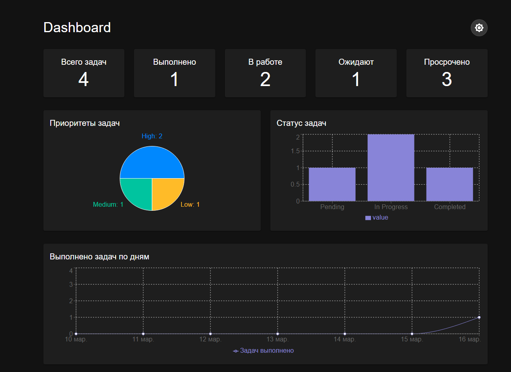
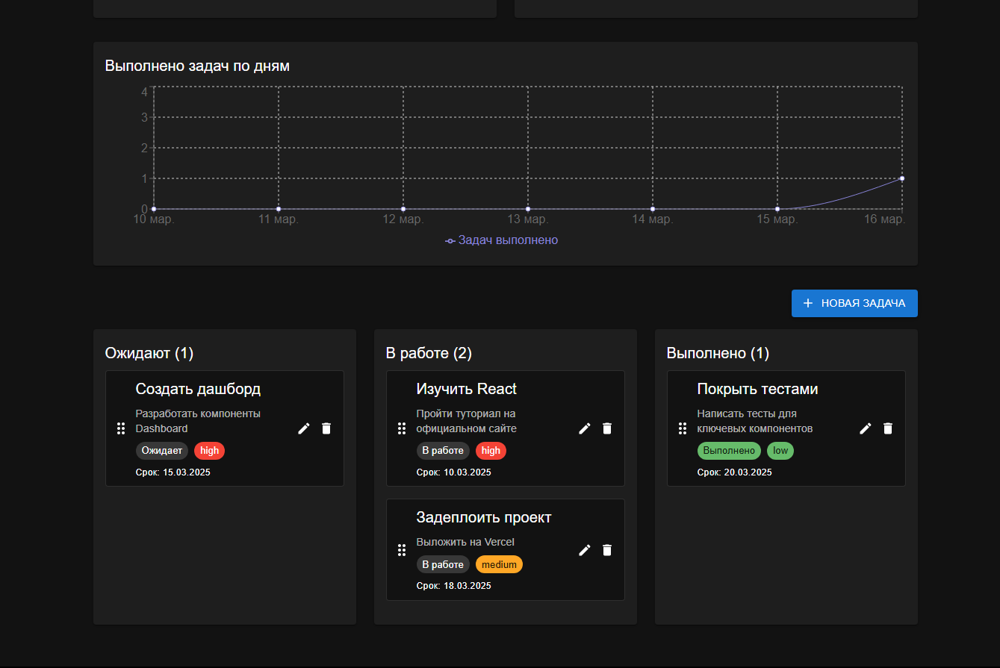
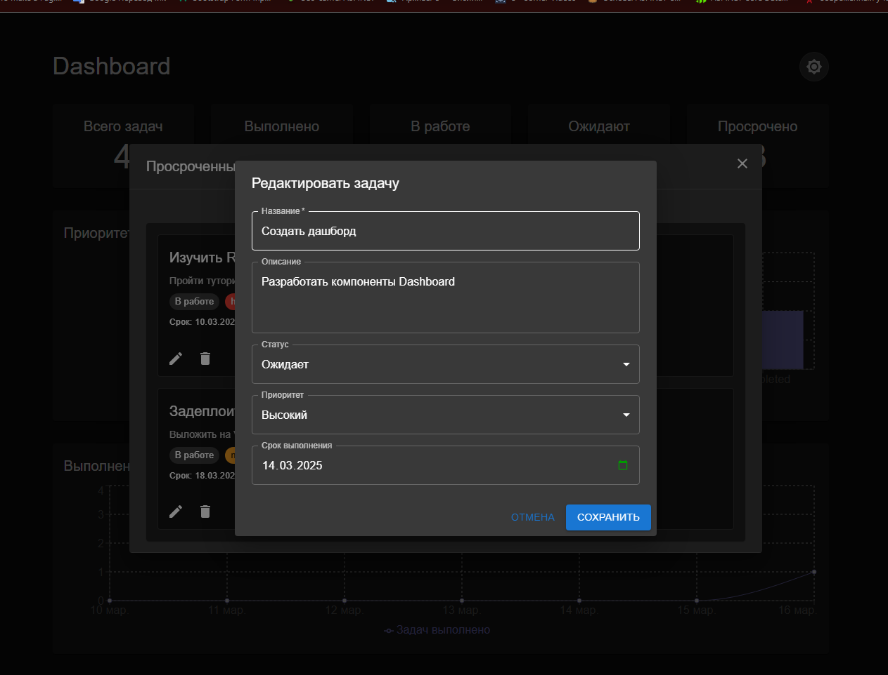

# React + TypeScript + Vite
# TaskFlow Dashboard

**Интерактивный дашборд для управления задачами** — SPA на React + TypeScript с визуализацией статистики, Drag-n-Drop и тёмной темой. Проект демонстрирует навыки работы с состоянием, графиками, анимациями и адаптивной вёрсткой.

## 🚀 Демо

[Открыть приложение](https://taskflow-dashboard-tau.vercel.app/)

## 📸 Скриншоты

### Светлая тема

*Главный экран с графиками и карточками статистики*

### Тёмная тема

*Тёмная тема автоматически меняет цвета*

### Доска задач

*Перетаскивание задач между статусами*

### Редактирование задачи

*Редактирование или создание новой задачи*

## ✨ Возможности

- 📊 **Дашборд** с карточками статистики (всего задач, выполнено, в работе, ожидают, просрочено)
- 📈 **Два типа графиков**: круговая диаграмма по приоритетам, столбчатая по статусам
- 📉 **Линейный график** выполнения задач за последние 7 дней
- 🎯 **Drag-n-Drop**: перетаскивание задач между колонками (статусами)
- ✏️ **CRUD операции**: создание, редактирование, удаление задач
- 💾 **Сохранение данных** в localStorage
- 🌓 **Тёмная/светлая тема** с сохранением выбора
- 🎨 **Адаптивный дизайн** (mobile-first)
- ⚡ **Анимации** с Framer Motion

## 🛠 Стек технологий

- **React** (функциональные компоненты, хуки)
- **TypeScript** (типизация)
- **Material-UI (MUI)** — компоненты и темизация
- **Recharts** — графики
- **@dnd-kit** — Drag-n-Drop
- **Framer Motion** — анимации
- **Vite** — сборка
- **LocalStorage** — хранение данных

## 🔧 Установка и запуск

1. Клонируй репозиторий:
   ```bash
   git clone https://github.com/alexpankov87/taskflow-dashboard.git
   cd taskflow-dashboard
   
Установи зависимости:
npm install

Запусти проект в режиме разработки:
npm run dev
Открой http://localhost:5173 в браузере.

📦 Сборка для продакшена
npm run build
